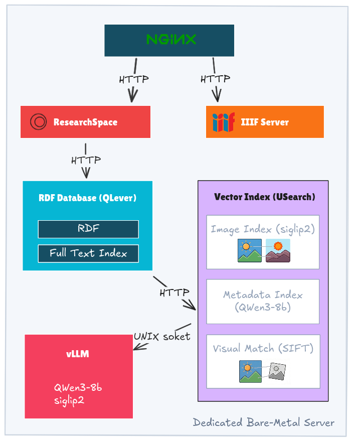

# Pharos artresearch.net Platform
## Technical White Paper

**Abstract**

The Pharos artresearch.net platform aggregates and serves the collections of twelve major art historical photographic archives across Europe and North America. The platform represents these collections as a Semantic Web knowledge graph using the CIDOC Conceptual Reference Model (CIDOC-CRM), preserving the descriptive richness of each institution's records rather than reducing them to a lowest common denominator. On top of this structured data layer, artresearch.net combines traditional metadata search with AI-driven vector embeddings to offer researchers several ways to find and connect works--by keyword, by concept, and by visual similarity. The whole system is built entirely on open-source software--including [ResearchSpace](https://github.com/researchspace/researchspace) for the frontend, [QLever](https://github.com/ad-freiburg/qlever) as the RDF triplestore, [USearch](https://github.com/unum-cloud/usearch) for vector similarity search, [vLLM](https://github.com/vllm-project/vllm) for embedding inference, and [IIPImage](https://iipimage.sourceforge.io/) for IIIF image serving--and runs on a single dedicated server.

This paper describes the data model, search capabilities, technical architecture, and data pipeline behind artresearch.net.

---

## 1. Data: Photographic Archives and the CIDOC-CRM

### 1.1 The Domain: Art Historical Photo Archives

PHAROS is an international consortium of photographic archives whose holdings document works of art and architecture primarily from Europe and North America. These archives are not simple image databases. Each photograph is a physical object in its own right--with its own provenance, materiality, printing technique, and cataloging history--while simultaneously serving as documentation of another work of art. A single archive record might describe the photograph's mount, inscription, and dating alongside the depicted artwork's attribution, iconography, and current location.

The artresearch.net platform currently provides access to approximately 1.4 million artworks, 2.1 million photographs, 120,000 artists, 6,700 photographers, and 59,000 repositories across the partner institutions.

### 1.2 Data Model: Preserving Richness, Not Flattening It

A common approach to data aggregation is to define a minimal shared schema and map every source into it. This works for basic discovery but discards the details that make each archive's records valuable--subject hierarchies, conservation notes, photographic techniques, mount descriptions, and institutional cataloging conventions.

The artresearch.net data model takes a different approach. All partner data is mapped to the **CIDOC Conceptual Reference Model (CIDOC-CRM)**, an ISO standard ontology (ISO 21127:2023) designed for cultural heritage documentation. CIDOC-CRM is event-based: rather than recording flat attributes, it models the processes and events that connect people, objects, places, and concepts. A production event connects an artist to a work, a photography event connects a photographer to a photograph of that work, and a curation activity connects an institution to the physical photograph in its collection.

This event-based structure means we can represent both the **materiality** of the photograph (its physical medium, dimensions, condition, mount) and the **conceptual content** it documents (the depicted artwork, its attribution, iconographic subjects) within a single coherent graph. Institution-specific details--such as the Frick Collection's subject classification system or the Zeri Foundation's iconographic vocabulary--are preserved as linked vocabulary terms rather than being collapsed into a generic field.

Because all partners share this model, their data naturally **complements one another**. Each archive has different strengths: one institution may provide exceptionally detailed iconographic descriptions, another contributes deep provenance records tracing an artwork's ownership history, while a third offers extensive architectural documentation or specialized photographic technique analysis. When their records converge on the same artwork--as they frequently do--the combined graph is richer than any single source could be. One institution's attribution data is enriched by another's iconographic analysis and a third's photographic documentation of condition and conservation history. The CIDOC-CRM structure makes this visible: overlapping records produce a denser web of events and relationships around a shared artwork, rather than conflicting flat records that need to be deduplicated.

The resulting knowledge graph contains over one billion RDF triples, where a researcher can follow connections from a photograph's physical properties to the depicted artwork's provenance, from an artist to all archives that hold photographs of their work, or from an iconographic subject to every visual representation across all collections.

### 1.3 Vocabulary Alignment

Each partner institution uses its own terminology and classification systems. Rather than replacing these with a single vocabulary, the platform aligns them through links to shared authority files: the Getty Art & Architecture Thesaurus (AAT), the Union List of Artist Names (ULAN), the Getty Thesaurus of Geographic Names (TGN), and Wikidata. This allows queries to work across institutional boundaries--a search for "tempera painting" finds records regardless of whether the source institution cataloged the technique in English, German, Dutch, or Italian--while the original terms remain accessible in each record.

In practice, achieving precise one-to-one alignment across all vocabularies is neither possible nor desirable. The classification systems used by different archives reflect distinct scholarly traditions, and forcing exact equivalences would misrepresent the nuances each system captures. The platform therefore **favors broader mappings over exact matches** wherever the semantics do not align perfectly: a `skos:broadMatch` or `skos:closeMatch` that preserves the approximate relationship between terms is more honest--and more useful for discovery--than a `skos:exactMatch` that overstates the degree of correspondence.

Where no suitable external authority exists, the consortium creates its own. A key example is the **PHAROS Photographer Authority**, a controlled vocabulary compiled collaboratively by PHAROS members to identify the photographers responsible for the images in their collections. Photographer identities in archival records are often ambiguous or inconsistent--references to "Alinari" might mean Fratelli Alinari, the Alinari studio, a specific Alinari brother, or later successor firms. The Photographer Authority addresses this through **umbrella terms** that group related identities (e.g., the various Alinari-associated names) under a single resolvable concept, while preserving the specific variant names used by each institution. In practice, this is a useful compromise: researchers can find all photographs associated with a studio or photographic dynasty through the umbrella term, while specialists can still distinguish the individual actors within the group.

Vocabulary alignment across the consortium is an ongoing effort. Achieving broad coverage requires iterative review by domain experts at each institution, and the process is expected to continue as new data is ingested and classification systems evolve. The alignment process also serves as a **data quality feedback loop**: examining institutional vocabularies side by side--across all partners simultaneously--routinely surfaces inconsistencies, duplicates, and classification errors in the original catalog data that are difficult to detect within a single collection. These findings are reported back to the contributing institutions to help them correct their own records.

For a detailed analysis of the usability challenges involved in aligning vocabularies and reconciling entities across art historical and photographic archives, see Daquino, Mambelli, and Kozlov (2026).[^1]

[^1]: Daquino M, Mambelli F, Kozlov A (2026), "Many-to-many. Usability challenges of entity reconciliation in art history and photographic studies". *Journal of Documentation*, Vol. 82 No. 2, pp. 362-380. [https://doi.org/10.1108/JD-09-2025-0284](https://doi.org/10.1108/JD-09-2025-0284)

### 1.4 Artwork Reconciliation

When multiple institutions hold photographs of the same artwork, each institution typically maintains its own independent record for that artwork, often with different identifiers, titles, attributions, and descriptive detail. Without reconciliation, the same painting appears as several unconnected entries in the aggregated dataset--one per contributing archive. **Artwork reconciliation** is the process of identifying these separate records as referring to a single real-world work and linking them together under a unified artwork record.

The platform approaches this problem by combining **visual matching** with **metadata matching**. The visual match pipeline (described in Section 2.2) detects near-identical images across collections--different photographs of the same painting, for instance--which is a strong signal that two records document the same physical work. This visual evidence is then cross-checked against structured metadata: matching artist attributions, titles, dimensions, media, and repository locations increase confidence that the records genuinely refer to the same artwork rather than, say, two different copies or versions. When the combined evidence is sufficiently strong, the records are linked to a single canonical artwork resource. For example, the Mona Lisa--photographed and cataloged by multiple PHAROS archives--is represented as [a single reconciled record](https://artresearch.net/resource/pharos/artwork/0c6efbedc68a28df2a0fc93479202c6533b8dcd4) that aggregates documentation from all contributing institutions.

Artwork reconciliation is currently in its initial phase. While the technical infrastructure for visual and metadata matching is in place, systematic reconciliation across the full dataset has not yet been carried out. As reconciliation progresses, the knowledge graph will increasingly reflect the true one-to-many relationship between artworks and the photographs that document them, making cross-institutional discovery increasingly effective.

---

## 2. Search: Capabilities and Implementation

The artresearch.net search system combines structured metadata queries with AI-based vector retrieval to give researchers multiple ways of finding relevant material. Rather than describing search features and their implementation separately, this section presents each search capability alongside its implementation.

The search interface is divided into two main approaches: **searching with text** and **searching with an image**. Each approach offers distinct search modes that can be used individually or together. On the backend, two core systems power these modes: **QLever**, a fast SPARQL engine with integrated full-text search, and a custom **Vector Search Server** built in C++ on the USearch library.



*Figure 1: Platform Architecture*

### 2.1 Searching with Text

When a user types keywords into the search bar, up to three search modes run in parallel, dispatched to their respective backend systems. Each result is labeled with indicators showing which modes matched it, and results that match multiple modes are ranked higher.

#### Text Match

A traditional keyword search. It finds records where the entered words appear literally in the artwork's metadata--titles, artist names, descriptions, inventory numbers, subject terms. This is the most precise mode: searching for "Pieta Rondanini" returns exactly that work. It is also language-specific: it will find "red flowers" in English-language records but not "rode bloemen" in Dutch ones.

Text Match searches deep into catalog metadata, which can surface unexpected but informative results. For example, searching "study of woman hands" returns a portrait titled "Study of a Woman's Head" because the subject field contains "Portraits: Women: Without hands: Head to right"--a technically correct keyword match that reveals how the work was cataloged, even if it doesn't match the researcher's intent.

**Implementation.** Text Match is powered by [QLever](https://qlever.cs.uni-freiburg.de/), a SPARQL engine written in C++ that builds a compressed, static index over the complete dataset. QLever handles both structured graph queries and full-text search within the same query planner. This integrated approach avoids a problem common to architectures that use a separate text index (e.g., Elasticsearch alongside a triplestore): in such setups, the text engine returns a ranked list truncated to some top-K, which is then joined against structured constraints, and if the intersection is small, relevant results can be missed entirely. QLever evaluates text predicates and graph predicates together, so structured filters and text relevance are considered simultaneously without premature cutoff.

#### Textual Similarity

A semantic search that matches the meaning of the query against the meaning of record descriptions, rather than matching literal words. This works across languages: a search for "red flowers" also finds works titled "Rode bloemen" (Dutch) or "Geraniums" (because the model understands that geraniums are flowers). A search for "study of woman hands" finds German records titled "Zwei Studien fur Frauenhande" and Dutch records titled "Studie van de handen van een vrouw."

This is the most useful mode for thematic browsing and for finding material across languages.

**Implementation.** Text embeddings are generated using [Qwen3-Embedding-8B](https://huggingface.co/Qwen/Qwen3-Embedding-8B), an 8-billion-parameter language model served by [vLLM](https://github.com/vllm-project/vllm). During the ETL pipeline, textual descriptions and metadata for every record--including ULAN biographical data--are embedded as `bfloat16` vectors and stored in a [USearch](https://github.com/unum-cloud/usearch) HNSW (Hierarchical Navigable Small World) index. At query time, the user's search text is embedded by the same model and compared against this index to retrieve the most semantically similar records.

#### Visual Similarity from Text

This mode translates the text query into a visual representation using a vision-language model and searches against image embeddings. It finds artworks that visually depict the described concept, even when the catalog metadata doesn't mention it. It can also identify subjects in black-and-white photographs--for instance, finding "red flowers" in a monochrome photo of geraniums by recognizing the flower shapes rather than relying on color information.

**Implementation.** This mode exploits the shared embedding space of [SigLIP2](https://huggingface.co/google/siglip2-so400m-patch16-naflex) (`google/siglip2-so400m-patch16-naflex`), a vision-language foundation model that maps both images and text into the same vector space. The user's text query is embedded using SigLIP2's text encoder and compared directly against the pre-computed image embeddings in the USearch index.

### 2.2 Searching with an Image

Users can also search by uploading an image or by navigating to the "Similar Works" tab on an artwork's page. Two modes are available:

#### Visual Match

Finds near-identical copies of the uploaded image in the catalog. It can identify the same artwork across different photographs, find cropped details within larger images, and detect manipulated versions (e.g., a photoshopped Mona Lisa still matches the original). This is designed for identification tasks: "Is this specific artwork in the collection?" or "Find all photographs of this particular painting."

**Implementation.** Visual Match uses a two-pass approach. First, the uploaded image is embedded using SigLIP2 and the global embedding index retrieves an initial set of candidates. Then, local visual features (RootSIFT keypoints) pre-extracted for all catalog images are compared against the query image's features using geometric verification--homography estimation via MAGSAC. This two-pass design combines fast approximate retrieval with precise structural matching at the pixel level, so that true duplicates are found even when they have been cropped, re-photographed, or manipulated.

#### Visual Similarity

Finds artworks that are visually related but not identical. This mode identifies works sharing similar composition, style, mood, or subject matter. Searching with an image of the Mona Lisa returns not only copies by other artists (such as the Prado version) but also prints, etchings, and other portraits with similar three-quarter poses or sfumato technique. This is useful for studying influence, artistic connections, and visual traditions.

**Implementation.** Visual Similarity uses the global SigLIP2 image embeddings directly. Images are processed with a custom patch-resizing algorithm capped at 1024 patches using Lanczos interpolation and stored as `bfloat16` vectors. These embeddings are pre-computed in batch using GPU instances (H200 via vast.ai) and loaded into the USearch HNSW index, which is memory-mapped for fast access at query time.

### 2.3 The Vector Search Server

All similarity-based search modes (Textual Similarity, Visual Similarity from Text, Visual Match, and Visual Similarity) are served by a single custom C++ application--the [Vector Search Server](https://github.com/ArtResearch/vector-index). It manages the image embedding index, the text embedding index, and the local visual feature store. The server exposes an HTTP interface that accepts SPARQL-like queries, allowing it to be called as a federated `SERVICE` endpoint from within QLever queries. Because of this, similarity results can, in principle, be combined with structured graph constraints in a single query. The server communicates with its embedding backend (vLLM) via Unix sockets rather than TCP, avoiding network overhead for real-time inference requests.

### 2.4 Combined Search and Scoring

When multiple search modes are active, results are aggregated with a combined score. Results appearing in multiple modes receive higher scores. Each mode's scores are normalized independently using the statistical distribution (mean and standard deviation) of similarity scores for that query, which provides a natural cutoff that adapts to each search rather than relying on fixed thresholds. When Visual Match produces a strong geometric verification, that signal heavily outweighs the semantic similarity scores, so genuine duplicates appear at the top of combined results.

### 2.5 Structured Exploration

Beyond free-text and image search, the platform supports faceted navigation over the knowledge graph. Researchers can filter results by institution, location (with hierarchical geographic facets), artist, time period, medium, and other structured properties. These facets operate directly on the CIDOC-CRM graph through SPARQL queries, allowing combinations like "paintings currently in Italian collections, attributed to Flemish artists, photographed before 1930."

**Implementation.** To support responsive faceted exploration of the deep CIDOC-CRM graph, a warmup service pre-computes and caches expensive transitive closures (e.g., hierarchical place or concept relationships) as materialized join results. Because these joins are already resolved, QLever can evaluate faceted queries in milliseconds rather than re-traversing the full graph at each request, keeping faceted navigation fast even over complex hierarchies.

---

## 3. Platform Infrastructure

### 3.1 Server and Deployment

All platform components run on one Hetzner bare-metal server (Intel Xeon Gold 5412U, 256 GB DDR5 RAM, ~$150/month). Collocating everything on a single machine eliminates network latency between components and simplifies deployment. The full stack consists of:

- **[ResearchSpace](https://github.com/researchspace/researchspace)** -- the frontend application providing the user interface for search and exploration
- **[QLever](https://github.com/ad-freiburg/qlever)** -- RDF triplestore with integrated full-text index
- **[Vector Search Server](https://github.com/ArtResearch/vector-index)** -- custom C++ similarity search service built on [USearch](https://github.com/unum-cloud/usearch)
- **[vLLM](https://github.com/vllm-project/vllm)** -- serves embedding and language models for real-time inference
- **[IIPImage Server](https://github.com/ruven/iipsrv)** -- IIIF-compliant image server for zoomable high-resolution images
- **[Nginx](https://nginx.org/)** -- reverse proxy handling routing and caching

### 3.2 ResearchSpace Frontend

The user-facing application is built on [ResearchSpace](https://www.researchspace.org/), an open-source platform for knowledge graph exploration. ResearchSpace provides semantic components that generate SPARQL queries from user interactions and render results using configurable templates.

For artresearch.net, the platform is extended with [custom search components](https://github.com/ArtResearch/artresearch.net). When a user submits a search query, the frontend sends a single SPARQL query to QLever. QLever handles both the structured graph constraints and the keyword text search natively, while delegating similarity-based retrieval to the Vector Search Server via a federated SPARQL `SERVICE` call. This means QLever joins the structured and similarity results within its own query planner before returning a unified result set to the frontend--there is no client-side merging of separate result streams. Faceted search, record pages, and IIIF image viewing are all handled through ResearchSpace's template system with custom CSS and HTML templates.

### 3.3 Embedding Generation (vLLM)

Both the text embeddings ([Qwen3-Embedding-8B](https://huggingface.co/Qwen/Qwen3-Embedding-8B)) and the vision-language embeddings ([SigLIP2](https://huggingface.co/google/siglip2-so400m-patch16-naflex)) require inference from large neural networks. This inference happens in two contexts:

**Batch indexing.** During the ETL pipeline, embeddings must be generated for millions of records and images. This is done on rented GPU instances (H200 via vast.ai), where the large batch sizes and high memory bandwidth of datacenter GPUs make the throughput cost-effective. To avoid redundant computation, the pipeline stores raw `bfloat16` vector embeddings for each image and text record in individual NPZ files (NumPy compressed archives with metadata). On subsequent ETL runs, only records whose source data has changed are re-embedded; unchanged vectors are loaded directly from the stored files into the index.

**Query-time inference.** When a user submits a search, their text or uploaded image must be embedded in real time before it can be compared against the pre-computed indices. This is served by [vLLM](https://github.com/vllm-project/vllm) running on the same dedicated server. The Vector Search Server communicates with vLLM through a Unix socket rather than TCP, which eliminates network protocol overhead. Because the platform runs on a modern Xeon processor with full AVX-512 support, the server uses SIMD instructions to generate and compare `bfloat16` embeddings quickly--fast enough that query-time embedding adds negligible latency to the search pipeline.

### 3.4 Image Serving and Quality Assurance

The platform takes a hybrid approach to image delivery. Where a partner institution operates its own IIIF (International Image Interoperability Framework) endpoint, the platform uses it directly. For institutions that do not provide IIIF services, the platform hosts images on its own server using [IIPImage](https://iipimage.sourceforge.io/), a fast and memory-efficient IIIF image server that handles high-resolution images with minimal resource requirements. Combined with the Nginx reverse proxy layer in front of it, tile requests for frequently viewed images are served almost instantly.

Regardless of the image source, the ETL pipeline runs a **verification and thumbnail generation** step for every image in the dataset. The pipeline checks that each image URL is reachable, that the downloaded image is not corrupted, and that it can be decoded successfully. Verified images are used to generate standardized thumbnails, which are served directly from Nginx for fast display in search results and browsing views. Images that fail verification--broken links, corrupt files, unsupported formats--are flagged and excluded from the user interface, so researchers never see broken images. This verification also produces reports for partner institutions, helping them find and fix problems in their own catalog data--dead links, mismatched file references, and silently corrupted image files that may have gone unnoticed.

---

## 4. Data Pipeline (ETL)

The data pipeline transforms raw institutional metadata into the indexed knowledge graph and precomputed embeddings that power the platform.

### 4.1 Transformation: XML to RDF

Partner institutions provide their metadata as XML records (typically harvested via OAI-PMH). These are transformed into RDF triples following the CIDOC-CRM ontology using a custom Haskell-based mapping tool.

The tool is a domain-specific language (DSL) inspired by the X3ML mapping framework. It encodes the CIDOC-CRM class hierarchy directly in the type system, so that mapping errors--such as assigning a physical property to an abstract conceptual entity--are caught at compile time rather than producing silently malformed RDF at runtime.

Mappings are defined as path trees that mirror the target RDF structure while navigating the source XML via XPath expressions:

```haskell
[x|controlfield[@tag='008']|] @> (
    P108i ---> (E12, relativeUri "/production") ==> [ 
        P4 ---> (E52, relativeUri "/timespan") ==> [ 
            P2 --> (E55, Meta.approximate_production_date),
            P82a --> dateTime [x|substring(text(), 1, 4)|] (Year, Lower)
        ]
    ]
)
```

This compact syntax has proven practical both for manual editing across hundreds of mappings per institution and for use with LLM-based coding assistants, which can generate and modify mappings given the DSL's regularity.

URI generation uses deterministic hashing (SHA256-based templates) to ensure stable, reproducible identifiers across pipeline runs. The mappings are covered by unit tests (`hspec`) that verify specific institutional edge cases produce the expected graph structures.

As with vocabulary alignment, the mapping process acts as a **data quality mechanism**. Transforming heterogeneous catalog records into a single rigorous ontology forces a holistic view of each institution's data and regularly turns up inconsistencies, missing fields, and structural oddities that are hard to spot from inside a single cataloging system. These are reported back to partner institutions to help improve their source data.

### 4.2 Enrichment and Verification

After the initial transformation, the base RDF is loaded into a transient triplestore where SPARQL `CONSTRUCT` queries normalize relationships and integrate external authority data (ULAN, AAT, TGN). Unresolved URIs are fetched from their authoritative sources.

Before finalization, a suite of SPARQL `ASK` queries run as integration tests, verifying structural integrity and data model constraints. Failures halt the pipeline.

### 4.3 Indexing

The final phase builds the production indices in parallel:

- **QLever index**: The complete RDF dataset is indexed by QLever's `IndexBuilderMain`, producing a compressed, permutation-based index with an integrated full-text index. This is a static build step--QLever does not load data incrementally but constructs an optimized index from scratch.
- **Vector indices**: Image and text embeddings are formatted and loaded into USearch HNSW indices. Local SIFT features are indexed separately.
- **Image processing**: Source images are validated, and IIIF-compatible derivatives and thumbnails are generated.

### 4.4 Pipeline Orchestration

The ETL pipeline is orchestrated by a Python application (`run-pipeline.py`) running in Docker containers. It supports step-by-step resumption, parallelization across CPU cores for the transformation phase, and configurable sub-tasks via layered `.conf` files.

---

## 5. Future Work: Integrated Vector Search in QLever

Currently, vector search runs as an external service that returns results to be joined with QLever's structured query results after the fact. This introduces the same truncation risk described earlier for external text indices: the vector search returns a top-K list, and if the intersection of those top-K results with the user's structural filters is small, relevant results may be lost.

Under an [NLnet grant (QLever-Similarity)](https://nlnet.nl/project/QLever-similarity/), we are collaborating with the QLever development team to build vector similarity search directly into QLever's query planner. This would allow similarity thresholds to be evaluated alongside structured graph constraints in a single query, eliminating the truncation issue and enabling queries like "find visually similar works by the same artist" without an external join step.
